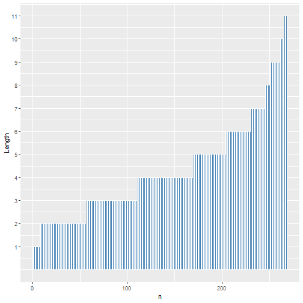
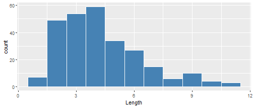

test
========================================================
author: 
date: 
autosize: true

First Slide
========================================================

Sampling is often a more practical method to gain information about a population, compared to conducting a Census.
    
It is critical when sampling to utilize a sampling method that minimizes any potential bias.      

  >- **Statistical Inference** is the process of using data from a sample to gain information about a population.
  
  >- **Sampling Bias** occurs when the method for selecting a sample causes the sample's properties to not reflect the population's properties.
  
  >- If **Sampling Bias** is present, **Statistical Inferences** are potentially erroneous.
  
========================================================


## Background


## Identify Sample and Population

To estimate what percent of people in the US wash their hands after using a public restroom, researchers pretended to comb their hair while observing 6000 people in public restrooms throughout the United States. They found that 85% of the people who were observed washed their hands after going to the bathroom. 

**What is the sample in this study? What is a reasonable population to which we might generalize?**
  
  >- <div class="red"> The sample is the 6000 people who were observed. A reasonable population to generalize to would be all people in the US. There are other reasonable answers to give for the population, such as all people in the US who use public restrooms or all people in the US who use public restrooms in the cities in which the study was conducted. Also, people might behave differently when alone than when there is someone else in the restroom with them, so we might want to restrict the population to people in a restroom with someone else. </div> 

## Sampling in 1948 Presidential Election {.smaller}

The day after the 1948 presidential election, the Chicago Tribune ran the headline “Dewey Defeats Truman.” However, Harry S Truman defeated Thomas E. Dewey to become the 33rd president of the United States. The newspaper went to press before all the results had come in, and the headline was based partly on the results of a large nationwide telephone poll which showed Dewey sweeping Truman.

**What is the sample and what is the population?**

  >- <div class="red"> The sample is all the people who participated in the telephone poll. The population is all voting Americans. </div>
  
**What did the pollsters want to infer about the population based on the sample?**

  >- <div class="red"> The pollsters wanted to estimate the percentage of all voting Americans who would vote for each candidate. </div>
  
**Why do you think the telephone poll yielded such inaccurate results?**

  >- <div class="red"> One reason the telephone poll may have yielded inaccurate results is that people with telephones in 1948 were not representative of all American voters. People with telephones tended to be wealthier and prefer Dewey while people without phones tended to prefer Truman. </div>

## Airline Satisifaction Survey

An airline sends an email to everyone who took a flight on their airline in the past month asking them to complete a survey regarding their satisfaction with the travel experience. The airline analyzes the data from all responses to such emails.

**What is the sample and in what population is the airline interested?**  

  >- <div class="red"> The sample is all people who choose to fill out the survey and the population is all people who fly this airline. </div>

**Do you expect these survey results to accurately portray customer satisfaction?**

  >- <div class="red"> The survey results will probably not accurately portray customer satisfaction. Many people won’t bother to fill out the survey if the flight was uneventful, while people with a particularly bad or good experience are more likely to fill out the survey. </div>
  
## Online Polls

An online poll conducted in April 2014 on biblegateway.com asked, “How often do you talk about the Bible in your normal course of conversation?” Over 5000 people answered the question, and 78% of respondents chose the most frequent option: Multiple times a week. 

**Can we infer that 78% of all people talk about the bible multiple times a week? Why or why not?**

  >- <div class="red"> No. People who visit the website for Bible Gateway and choose to take the poll are probably more likely than the general public to talk about the bible. This sample is not representative of the population of all people, so the results cannot be generalized to all people. </div>
  
## Activity

Your objective is to use a sample to estimate the **population mean** for number of letters (i.e., word length) in all the words spoken in the Gettysburg Address.

  >- What is the **mean** word length for the following population of words?  
  {Dog, Cat, Horse, Iguana, Parrot} 

  
  >- <div class="red"> $\frac{3+3+5+6+6}{5}=4.6$ </div>


## Gettysburg Address {.smaller}

Four score and seven years ago our fathers brought forth upon this continent, a new nation, conceived in Liberty, and dedicated to the proposition that all men are created equal. 

Now we are engaged in a great civil war, testing whether that nation, or any nation so conceived and so dedicated, can long endure. We are met on a great battle-field of that war. We have come to dedicate a portion of that field, as a final resting place for those who here gave their lives that that nation might live. It is altogether fitting and proper that we should do this. 

But, in a larger sense, we can not dedicate -- we can not consecrate -- we can not hallow -- this ground. The brave men, living and dead, who struggled here, have consecrated it, far above our poor power to add or detract. The world will little note, nor long remember what we say here, but it can never forget what they did here. It is for us the living, rather, to be dedicated here to the unfinished work which they who fought here have thus far so nobly advanced. It is rather for us to be here dedicated to the great task remaining before us -- that from these honored dead we take increased devotion to that cause for which they gave the last full measure of devotion -- that we here highly resolve that these dead shall not have died in vain -- that this nation, under God, shall have a new birth of freedom -- and that government of the people, by the people, for the people, shall not perish from the earth. 

[CNN Article](https://www.cnn.com/2015/11/19/us/gettysburg-address-famous-quotes/index.html) 


## Graphic of Gettysburg Address


```r
ggplot(speech, aes(ID, Length)) +
  geom_bar(stat='identity', width=1, aes(fill=Length, color=Length))
```





## Distribution (by counts) of a Numerical Variable


Distribution of Words by Length

```

 1  2  3  4  5  6  7  8  9 10 11 
 7 49 54 59 34 27 15  6 10  4  3 
```


## Distribution (by percent of whole)


Distribution of Words by Length

```

    1     2     3     4     5     6     7     8     9    10    11 
0.026 0.183 0.201 0.220 0.127 0.101 0.056 0.022 0.037 0.015 0.011 
```

## Representative Sampling via Random Sampling

  >- A **representative sample** resembles the population, only in smaller numbers.

  >- Random sampling tends to produce a representative sample.
  
  >- Random sampling avoids sampling bias.
  
  >- How do we take a random sample of words from the Gettysburg Address?


## Obtain random numbers in R {.smaller}


```r
sample(1:268, 10)  
```

```
 [1] 149  58  69 230 263 195 110 257 180 214
```

Help File - **?sample**

**Description**
sample takes a sample of the specified size from the elements of x using either with or without replacement.

**Usage**
sample(x, size, replace = FALSE, prob = NULL)


**Arguments**
**x**	- either a vector of one or more elements from which to choose, or a positive integer. See ‘Details.’

**n**	- a positive number, the number of items to choose from. See ‘Details.’

**size** - a non-negative integer giving the number of items to choose.

**replace**	- should sampling be with replacement?

**prob** - a vector of probability weights for obtaining the elements of the vector being sampled.


## Random Sampling in R {.smaller}


```r
speech_sample <- sample_n(speech, 10)
speech_sample
```

```
    ID    Word Length
1    4   seven      5
2  199    task      4
3   99      we      2
4  250 freedom      7
5  152     but      3
6   46  nation      6
7   60   great      5
8  265  perish      6
9   47      so      2
10  57     met      3
```

```r
mean(speech_sample$Length)
```

```
[1] 4.3
```

## Random Sampling Simulation from RossmanChance

[Sampling App](http://www.rossmanchance.com/applets/OneSample.html?population=gettysburg)

