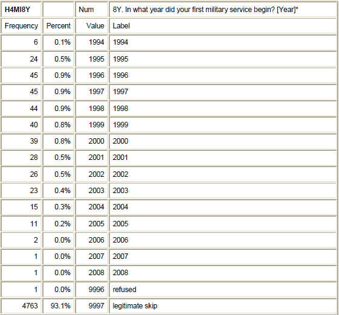
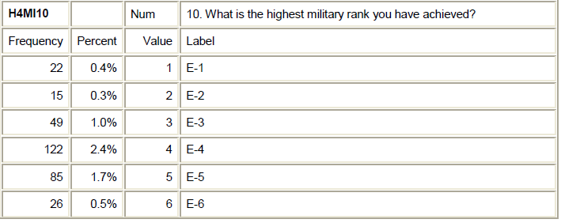
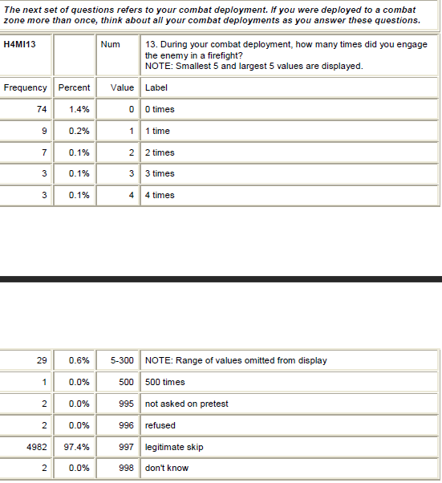
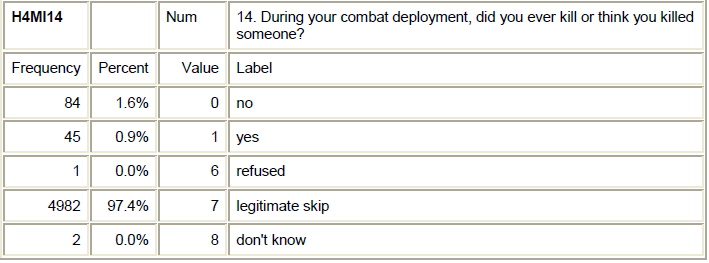
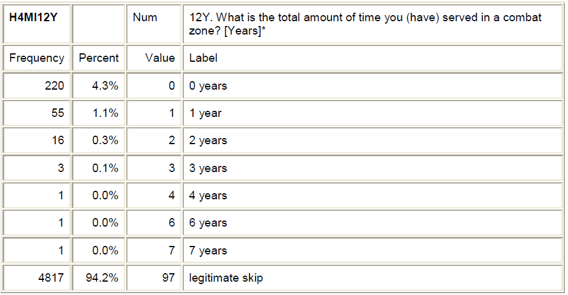

## Topic area statement: 

## Personal Codebook: 

To put the snips (images) in this document.  

First upload the images to the `hw` folder. 
Then follow the example shown below

## Draft of a few Research Questions

What is the relationship between highest rank attained and the number of firefights involved in?

Does spending more time in a combat zone have a relationship to having a higher rank?h

Is there a spike in joining the military and American involvement in military conflicts?

## Literature review - Three Articles

### Article 1

### Article 2

### Article 3

## Refinement of your Research Questions

## Formative assessment:  Statistics Concepts

The following questions are to assess your understanding of our first two weeks' statistical topics.

8.  **Infections Can Lower IQ** A headline in June 2015 proclaims “Infections can lower IQ.” The headline is based on a study in which scientists gave an IQ test to Danish men at age 19. They also analyzed the hospital records of the men and found that 35% of them had been in a hospital with an infection such as an STI or a urinary tract infection. The average IQ score was lower for the men who had an infection than for the men who hadn’t.  

    + What are the cases in this study?
      + The kids in question. 
    + What is the explanatory variable? Is it categorical or quantitative?
      + Spank or no spank. Categorical.
    + What is the response variable? Is it categorical or quantitative?
      + Response is the score in the IQ test. It is quantatative.
    + Does the headline imply causation?
      + Never did, does, will.
    + Is the study an experiment or an observational study?
     + Obversation study.
    + Is it appropriate to conclude causation in this case?
      + No, not at all.

\

9. **Hormones and Fish Fertility** When women take birth control pills, some of the hormones found in the pills eventually make their way into lakes and waterways. In one study, a water sample was taken from various lakes. The data indicate that as the concentration of estrogen in the lake water goes up, the fertility level of fish in the lake goes down. The estrogen level is measured in parts per trillion (ppt) and the fertility level is recorded as the percent of eggs fertilized. 

    + What are the cases in this study?
      + The fertility of the fish in the various lakes.
    + What are the variables? 
      + The amount of estrogen in the water.  
    + Classify each variable as either categorical or quantitative.
      + The amount of estrogen would be quantitative, along with fertility. 
    + Identify the explanatory and response variables.
      +Amount of estrogen is explanatory. The fertility rate is response.
\
10. **Drinking Age** A biased sampling situation is described for the following study;  

    To estimate the proportion of Americans who support changing the drinking age from 21 to 18, a random sample of 100 college students are asked the question, “Would you support a measure to lower the drinking age from 21 to 18?”  
    
    + What is the sample?
      +The 100 college students.
    + What is the researcher's population of interest?
      + College students.
    + To what population we can generalize to, (for our given sample)?
      +That the students would be more inclined to say yes as they are all college students. 

    
    
    
    